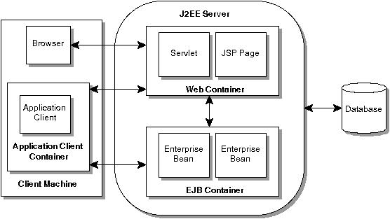

## J2EE
>> J2EE  technology provides a component-based approach to the design, development, assembly, and deployment of enterprise applications.
It Offers multitiered distributed application model, the ability to reuse components,  integrated Extensible Markup Language (XML)-based data interchange, a unified security model, and flexible transaction control.

This will cover below Topics to cover J2EE concepts

#### Multitiered Applications
>>  Application logic is divided into components according to function, and the various application components that make up a J2EE application are installed on different machines depending on the tier in the multitiered J2EE environment to which the application component belongs.

###### Components Are
* Client tier runs on client machine (Dynamic html pages)
* Web tier run on J2EE machine (JSP pages, Servlet)
* Business Tier run on J2EE machine (Enterprise Bean)
* Enterprise Information System (EIS)  (database)
###### Container
* Containers are the interface between a component and the low-level platform specific functionality that supports the component. Before a Web, enterprise bean, or application client component can be executed, it must be assembled into a J2EE application and deployed into its container.
* The assembly process involves specifying container settings for each component in the J2EE application and for the J2EE application itself. Container settings customize the underlying support provided by the J2EE server, which includes services such as security, transaction management, Java Naming and Directory Interface™ (JNDI) lookups, and remote connectivity.
###### Packaging
* J2EE components are packaged separately and bundled into a J2EE application for deployment.
* A J2EE application and each of its modules has its own deployment descriptor.A deployment descriptor is an XML document with an .xml extension that describes a component’s deployment settings
* EAR, JAR, WAR
   * Each WAR file contains a deployment descriptor, the Web component files, and related resources.
   * Each application client JAR file contains a deployment descriptor, the class files for the application client, and related files
   * A J2EE application with all of its modules is delivered in an Enterprise Archive (EAR) file. An EAR file is a standard Java Archive (JAR) file with an .ear extension
 >> Using modules and EAR files makes it possible to assemble a number of different J2EE applications using some of the same components. No extra coding is needed; it is just a matter of assembling various J2EE modules into J2EE EAR files.

###### Java Servlet Technology
* Java Servlet technology lets you define HTTP-specific servlet classes. A servlet class extends the capabilities of servers that host applications accessed by way of a request-response programming model. Although servlets can respond to any type of request, they are commonly used to extend the applications hosted by Web servers.

###### JavaServer Pages Technology (JSP)
* JavaServer Pages technology lets you put snippets of servlet code directly into a text-based document. A JSP page is a text-based document that contains twotypes of text: static template data, which can be expressed in any text-based format such as HTML, WML, and XML, and JSP elements, which determine how the page constructs dynamic content.

###### Java Message Service 1
*The JMS is a messaging standard that allows J2EE application components to create, send, receive, and read messages. It enables distributed communication that is loosely coupled, reliable, and asynchronous

Other Some Servicse Are
* JNDI
* Java Transaction API
* Java Mail (Application components, Service Provider)
* Java Bean Activation Framework
* Java API For XML Processing (JAXP)
* J2EE Connector Archietecture
* Java Authentication and Authorization Service 1.0
   * The Java Authentication and Authorization Service (“JAAS”) provides a way for a J2EE application to authenticate and authorize a specific user or group of users to run it.
   * JAAS is a Java programing language version of the standard Pluggable Authentication Module (PAM) framework that extends the Java 2 Platform security architecture to support user-based authorization.
* Database Access
  * The relational database provides persistent storage for application data. A J2EE implementation is not required to support a particular type of database, which means that the database supported by different J2EE products can vary.

>> Summarizing
The J2EE platform is a platform-independent, full systems integration solution that creates an open marketplace in which every vendor can sell to every customer.
The J2EE APIs enable systems and applications integration through the following:
* Request and Response  - JSP & Servlet
* Reliable Security - JAAS
* XML Based Data Interchange - JAXP
* Simplified Interoperability - J2EE Connector Arch
* DB Connectivity - JDBC API
* Enterprise Appln Integration with  - JSM, JNDI , JTA
