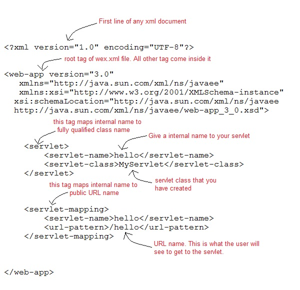
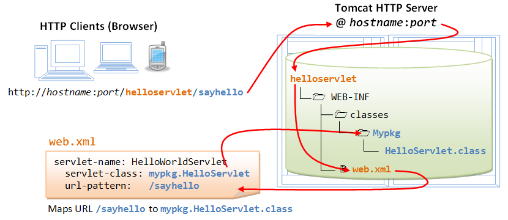

### Servlet Hands On

The servlet can be created using
* Implementing Servlet Interface
* extending GenericServlet class or
* extending HttpServlet

>We mostly used HttpServlet class, it provides http request specific methods

----------
##### Directory Structure
Defines where need to put different types of file so that web container get information.

Ref: https://www.cis.upenn.edu/~matuszek/cit597-2006/Pages/file_structures.html

##### Servlet Creation

Example Code Here [Hello.java](/J2EE/hands-on/0-no-ide-servlet/servlet-src/Hello.java)

##### Compiling & Deploying

To compile servlet different server provide different jar files
* Apache Tomcat  - [servlet-api.jar](/lib/servlet-api.jar)
* weblogic - [weblogic.jar]()
* Glassfish - [javaee.jar]()

* To load the jar file set as class path or paste the jar file in *JRE/lib/ext* folder
* Compile the Hello.java file under folder [/J2EE/hands-on/0-no-ide-servlet/servlet-src/Hello.java](/J2EE/hands-on/0-no-ide-servlet/servlet-src/Hello.java)
* Copy the Hello.class file to folder [/J2EE/hands-on/0-no-ide-servlet/WEB-INF/classes]

###### Create Deployment Descriptor
* Deployment Descriptor is an xml file, web container get information about the servlet to be invoked
* it named [web.xml](/J2EE/hands-on/0-no-ide-servlet/WEB-INF/web.xml)

###### Deploying
* Start the downloaded tomcat server in command line
* to change the port number, in apache folder conf/server.xml, Change the Connector port = 8080 and replace 8080 by any four digit number instead of 8080
* copy the project [folder](/J2EE/hands-on/0-no-ide-servlet) to tomcat web apps directory
* start the servlet access the site in browser http://localhost:8080/0-no-ide-servlet/hello

* Other ways of deploying
	* create war file and paste it into web app directory
	To create war file run command in project [folder](/J2EE/hands-on/0-no-ide-servlet) 
    `jar cvf warproject.war * `
     * Run the tomcat server and access http://localhost:8080/warproject/hello (warproject is created war file name).

