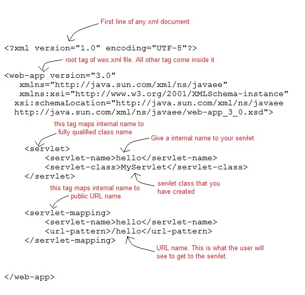

[Go to Home Page](/training)

***

### Deployment Descriptor

* Deployment Descriptor is an xml file, web container get information about the servlet to be invoked
* it named [web.xml](/training/J2EE/hands-on/0-no-ide-servlet/WEB-INF/web.xml)

>web.xml explained below




* web.xml file present in webapp --WEB-INF in maven project  or webcontent-WEB-INF folder in the dynamic web project.
* servlet mapping defined here
* Sample web.xml [ here](/training/J2EE/hands-on/1-servlet-jsp/WebContent/WEB-INF/web.xml)

#### welcome-file-list in web.xml
[welcome-file-list](/training/J2EE/hands-on/1-servlet-jsp/WebContent/WEB-INF/web.xml#L4)
>Element of webapp, to define list of welcome files, welcome-file define welcome file in that list

* If you have specified welcome-file in web.xml, and all the files index.html, index.htm and index.jsp exists, priority goes to welcome-file.

* If welcome-file-list entry doesn't exist in web.xml file, priority goes to index.html file then index.htm and at last index.jsp file.


#### Load On Start up

* *load-on-startup* element in web.xml loads the servlet at the time of deployment or server start if the value is positive know as **pre initialization of servlet**
* If you pass the positive value, the lower integer value servlet will be loaded before the higher integer value servlet

>As we know the servlet loaded at the time of first request, so for first request it consumes more time. So  If you specify the load-on-startup in web.xml, servlet will be loaded at project deployment time or server start. So, it will take less time for responding to first re

>If you pass the positive value, the lower integer value servlet will be loaded before the higher integer value servlet

```xml
<web-app>  
  <servlet>  
   <servlet-name>hello</servlet-name>  
   <servlet-class>com.training.Hello</servlet-class>  
   <load-on-startup>0</load-on-startup>  
  </servlet>  

  <servlet>  
   <servlet-name>GenericServletExample</servlet-name>  
   <servlet-class>com.training.GenericServletExample</servlet-class>  
   <load-on-startup>1</load-on-startup>  
  </servlet>  
</web-app>

```
>If you pass the *negative* value, servlet will be loaded at request time, at first request.

***

[Go to Home Page](/training)

***
